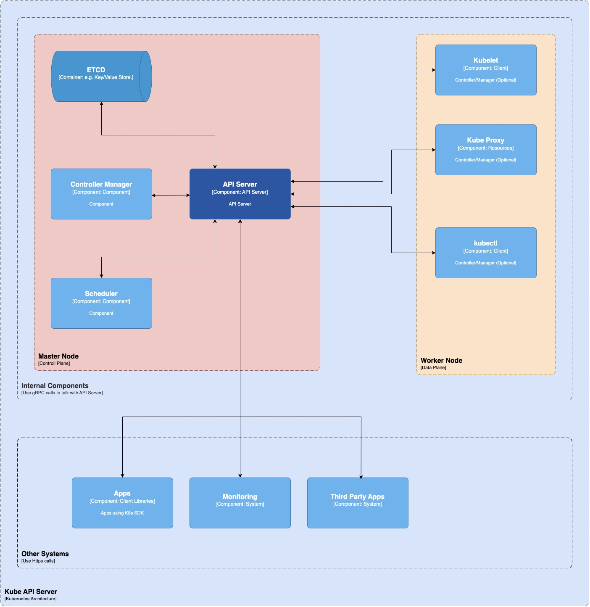

#### API Server

The kube-API server helps users and other components communicate with the cluster easily. Some monitoring systems and third-party services may also (very rarely) use it to interact with the cluster. When using a CLI like kubectl to manage the cluster, you use HTTP REST APIs to talk to the API server.

> The internal cluster components (like the scheduler and controller), however, use gRPC for this communication.

The API server encrypts its communication with other components to ensure safety through TLS. Its primary function is to manage API requests, validate data for API objects, authenticate and authorize users, and coordinate processes between the control plane and worker node components.

The API server works only with etcd and includes a built-in bastion apiserver proxy, enabling external access to ClusterIP services.