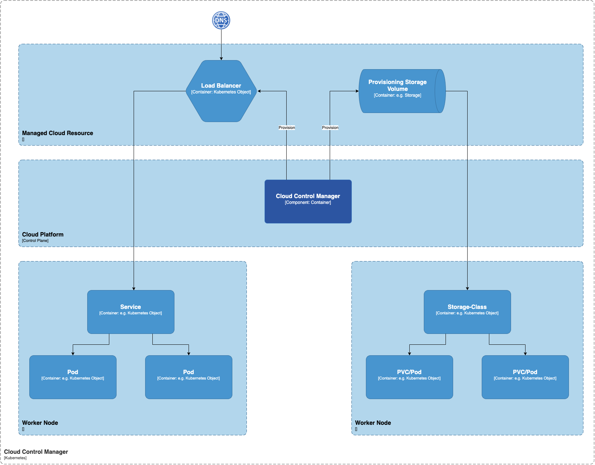

#### Cloud Controller Manager (CCM)

When deploying Kubernetes in cloud environments, it’s essential to bridge Cloud Platform APIs and the Kubernetes cluster. This can be done using the cloud controller manager, which allows the core Kubernetes components to work independently and enables cloud providers to integrate with Kubernetes using plugins.

Cloud Controller Manager contains a set of cloud platform-specific controllers that ensure the desired state of cloud-specific components (nodes, Loadbalancers, storage, etc). Following are the three main controllers that are part of the cloud controller manager.

* **Node controller:** This controller updates node-related information by talking to the cloud provider API. For example, node labeling & annotation, getting hostname, CPU & memory availability, nodes health, etc.
* **Route controller:** It is responsible for configuring networking routes on a cloud platform. So that pods in different nodes can talk to each other.
* **Service controller:** It takes care of deploying load balancers for kubernetes services, assigning IP addresses, etc.

Following are some of the classic examples of cloud controller manager.

Deploying Kubernetes Service of type Load balancer. Here Kubernetes provisions a Cloud-specific Loadbalancer and integrates with Kubernetes Service.
Provisioning storage volumes (PV) for pods backed by cloud storage solutions.
Overall Cloud Controller Manager manages the lifecycle of cloud-specific resources used by kubernetes.