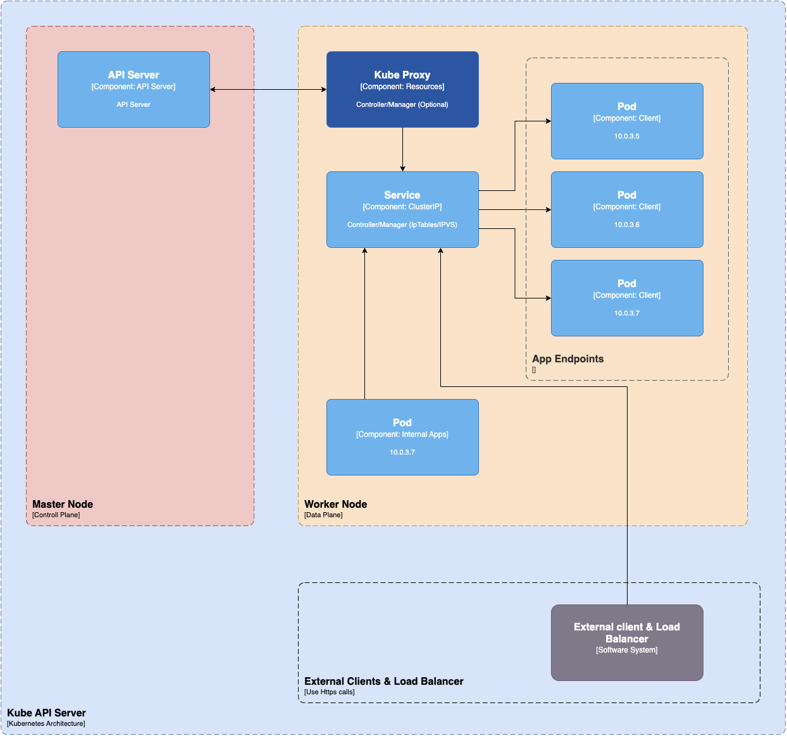

#### Kube Proxy

Kube-proxy is a daemon that runs on every node as a daemonset. It is a proxy component that implements the Kubernetes Services concept for pods. (single DNS for a set of pods with load balancing). It primarily proxies UDP, TCP, and SCTP and does not understand HTTP.

Kube-proxy communicates with the API server to get the details about the Services and their respective pod IPs and ports. It monitors for service changes and end points and then uses various modes to create or update rules for routing traffic to pods behind a Service.

The modes include IPTables, IPVS, Userspace, and Kernelspace. When using IPTables mode, Kube-proxy handles traffic with IPtable rules and randomly selects a backend pod for load balancing.
