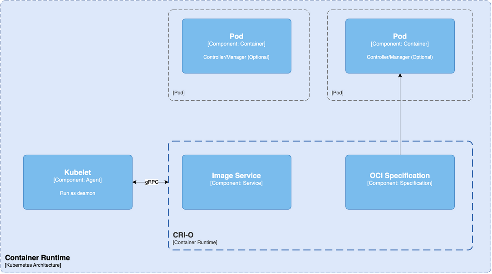
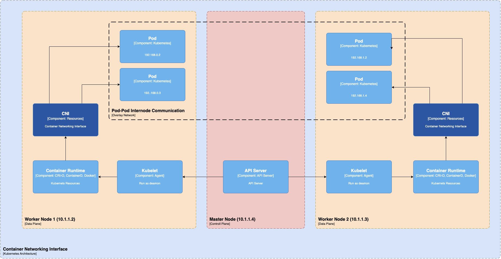

# Kubernetes

Kubernetes is a container orchestration system that helps automate application deployment, scaling, and management. It groups containers into logical units, making managing them easier. Kubernetes provides features of auto-scaling, load balancing, self-healing, and service discovery. Originally built by Google, it is currently maintained by the Cloud Native Computing Foundation.

## Architecture

Kubernetes architecture is a set of components spread across different servers or clusters that work together to ensure a reliable and adaptable environment for containerized workloads.

Each Kubernetes cluster consists of control plane nodes and worker nodes. Let’s understand these and other critical elements of the Kubernetes architecture diagram in detail.

---

## Components

The Kubernetes architecture follows a master-worker model, where the master, known as the control plane, manages the worker nodes. On the other hand, containers (encapsulated in pods) are deployed and executed in the worker nodes. These nodes can have virtual machines (on-premise or on the cloud) or physical servers.

### Control Plane

The control plane is responsible for container orchestration and maintains the state of a cluster.

**Control Plane Components**

The Kubernetes control plane consists of several components, each responsible for a specific task (as explained below). These components work together to ensure that each Kubernetes cluster’s state matches the pre-defined desired state.

#### API Server

The kube-API server helps users and other components communicate with the cluster easily. Some monitoring systems and third-party services may also (very rarely) use it to interact with the cluster. When using a CLI like kubectl to manage the cluster, you use HTTP REST APIs to talk to the API server.

> The internal cluster components (like the scheduler and controller), however, use gRPC for this communication.

The API server encrypts its communication with other components to ensure safety through TLS. Its primary function is to manage API requests, validate data for API objects, authenticate and authorize users, and coordinate processes between the control plane and worker node components.

The API server works only with etcd and includes a built-in bastion apiserver proxy, enabling external access to ClusterIP services.

#### etcd

etcd is a useful tool for storing key-value data in a distributed approach. It’s designed for storing data about Kubernetes clusters, such as information about pods, their state, and namespaces. etcd is only accessible from the API server to maintain security.

Kubernetes uses etcd to manage its key-value API through gRPC. All objects are stored under the /registry directory key in key-value format.

The api-server of Kubernetes uses the etcd’s watch feature to monitor any modifications to an object’s state. As the sole Statefulset component in the control plane, etcd is an excellent database for Kubernetes.

#### Kube-Scheduler

When deploying a pod in a Kubernetes cluster, the kube-scheduler identifies the best worker node that satisfies the pod requirements, such as CPU, memory, and affinity. Upon identification, it schedules the pod on the right node.

This process is made possible because of etcd’s role in storing vital information needed by Kubernetes to run smoothly. The necessary information is stored in the etcd file cabinet whenever a request is made to Kubernetes.

Kubernetes schedules a pod using several techniques.

First, it filters through all available nodes to find the best ones for the pod. Then, it assigns each node a score based on scheduling plugins. The scheduler selects the best node and binds the pod to it. This process ensures that high-priority pods get the priority they deserve and that custom plugins can be easily added to the mix. It’s an innovative and efficient way to manage Kubernetes pods.

#### Controller-Manager

The kube-controller-manager handles different controllers that help create replicas of containers and ensure the cluster stays in the desired state.

**Example**

when you create a manifest YAML file to specify the deployment ( two replicas, one volume mount, config map, etc.). With the in-built deployment controller, the deployment will always remain in the desired state.

There are several types of controllers managed by the kube-controller-manager:

* **Deployment controllers** handle the deployment of multiple replicas of an application running inside containers.

* **Replication controllers** ensure a specific number of pod replicas are always running. If a pod fails, the replication controller creates a new one to take its place.

* **StatefulSet controllers** provide useful features like persistent storage, unique network identities, and a controlled way to deploy and scale the application.

* **DaemonSet controllers** ensure that a specific pod runs on every node in the cluster or only on selected nodes based on particular labels.

#### Cloud Controller Manager (CCM)

When deploying Kubernetes in cloud environments, it’s essential to bridge Cloud Platform APIs and the Kubernetes cluster. This can be done using the cloud controller manager, which allows the core Kubernetes components to work independently and enables cloud providers to integrate with Kubernetes using plugins.

Cloud Controller Manager contains a set of cloud platform-specific controllers that ensure the desired state of cloud-specific components (nodes, Loadbalancers, storage, etc). Following are the three main controllers that are part of the cloud controller manager.

* **Node controller:** This controller updates node-related information by talking to the cloud provider API. For example, node labeling & annotation, getting hostname, CPU & memory availability, nodes health, etc.
* **Route controller:** It is responsible for configuring networking routes on a cloud platform. So that pods in different nodes can talk to each other.
* **Service controller:** It takes care of deploying load balancers for kubernetes services, assigning IP addresses, etc.

Following are some of the classic examples of cloud controller manager.

Deploying Kubernetes Service of type Load balancer. Here Kubernetes provisions a Cloud-specific Loadbalancer and integrates with Kubernetes Service.
Provisioning storage volumes (PV) for pods backed by cloud storage solutions.
Overall Cloud Controller Manager manages the lifecycle of cloud-specific resources used by kubernetes.

### Worker Nodes

Worker nodes are critical components in a Kubernetes architecture because they help in running containerized applications.

### Worker Node Components

Worker nodes are the primary execution units in a Kubernetes cluster where the actual workloads run. Each worker node can host multiple pods, each containing one or more containers running inside them. Every worker node consists of three components responsible for scheduling and managing these pods:

#### Kubelet

The kubelet is an essential component that runs on every node in the Kubernetes cluster. It acts as an agent responsible for registering worker nodes with the API server and working with the podSpec primarily from the API server.

The kubelet creates, modifies, and deletes containers for the pod. Additionally, it handles liveliness, readiness, and startup probes. It also mounts volumes by reading pod configuration and creating respective directories reporting Node pod status via calls to the API server.

The Kubelet starts the api-server, scheduler, and controller manager as static pods while bootstrapping the control plane. The kubelet is crucial in managing the containers and ensuring the pod is in the desired state.

#### Kube Proxy

Kube-proxy is a daemon that runs on every node as a daemonset. It is a proxy component that implements the Kubernetes Services concept for pods. (single DNS for a set of pods with load balancing). It primarily proxies UDP, TCP, and SCTP and does not understand HTTP.

Kube-proxy communicates with the API server to get the details about the Services and their respective pod IPs and ports. It monitors for service changes and end points and then uses various modes to create or update rules for routing traffic to pods behind a Service.

The modes include IPTables, IPVS, Userspace, and Kernelspace. When using IPTables mode, Kube-proxy handles traffic with IPtable rules and randomly selects a backend pod for load balancing.

#### Container Runtime

Just like Java Runtime (JRE) is required to run Java programs, container runtime is essential to running containers. Container runtime is responsible for various tasks, such as pulling images from container registries, allocating and isolating resources for containers, and managing the entire lifecycle of a container on a host.

Kubernetes interacts with container runtimes through Container Runtime Interface (CRI), which defines the API for creating, starting, stopping, and deleting containers and managing images and container networks.

The Open Container Initiative (OCI) is a set of standards for container formats and runtimes. Kubernetes supports multiple container runtimes compliant with CRI, such as CRI-O, Docker Engine, and containerd.

The kubelet agent interacts with the container runtime using CRI APIs to manage the lifecycle of a container and provides all the container information to the control plane.

---

## Addon Components

To guarantee the complete functionality of your Kubernetes cluster, it is essential to incorporate supplementary add-on components along with the primary components. The selection of add-on components largely depends on your project requirements and use cases.

Some popular addon components you might need on a cluster include CNI Plugin for networking, CoreDNS for the DNS server, Metrics Server for resource metrics, and Web UI for managing objects via web UI.

By enabling these add-ons, you can greatly improve your Kubernetes cluster’s performance and functionality.

### CNI Plugin

Container Networking Interface (CNI) is a way to create network connections for containers, and it works with many different orchestration tools, not just Kubernetes. Organizations have varying needs regarding container networking, like security and isolation.

Many different companies have created solutions for these needs using CNI. These solutions are called CNI Plugins, and you can choose one based on your needs.

This is how things operate when using CNI Plugins with Kubernetes: Each pod (a container or group of containers) gets a unique IP address. Then, the CNI Plugin connects the pods together, no matter where they’re located. This means that pods can communicate with each other even if they’re on different nodes.

Many different CNI Plugins exist, including popular ones like Calico, Flannel, and Weave Net. It’s essential to choose the right one for your specific needs. Container networking is a huge responsibility, but CNI Plugins make managing it easier.

---

# Kubernetes Tools

### CLI Tools

* **kubectl**: The primary CLI tool for Kubernetes; it allows managing applications and clusters. With Kubectl, you can inspect cluster resources, create, update, delete components, and much more.
* **Helm**: A Kubernetes package manager streamlining Kubernetes applications’ installation and management. It manages Kubernetes applications through Helm Charts, which define, install, and upgrade complex Kubernetes applications.
* **Skaffold**: A command-line tool that facilitates continuous development for Kubernetes applications. It automates the workflow for building, pushing, and deploying applications.
* **Customize**: A Kubernetes native configuration management tool allows customized Kubernetes deployments without needing templating engines. It supports multiple build strategies like strategic merge patches, JSON 7001 patches, and more.
* **Kubeval**: A tool to validate your Kubernetes configuration files, ensuring they are valid and in the correct format. It can be run locally and in your CI/CD, ensuring configurations are correct before deployment.

### Monitoring Tools

* **Sematext Monitoring**: A real-time monitoring solution for traditional and microservice-based applications deployed on Kubernetes, featuring customizable alerts, analytics reports, and dashboards. It also provides Kubernetes Audit integration and infrastructure mapping.
* **Kubernetes Dashboard**: A simple web-based UI addon for Kubernetes clusters that provides basic metrics related to memory and CPU usage statistics across nodes and the ability to monitor the health of workloads.
* **Prometheus**: A popular open-source tool used to monitor Kubernetes, Prometheus utilizes a powerful multidimensional data model, a flexible query language (PromQL), and a built-in real-time alerting mechanism. It follows a pull model for metrics.
* **Grafana**: It is commonly used with Prometheus for monitoring and visualizing metrics. It offers powerful visualization options for your Kubernetes cluster data.
* **Jaeger**: You can trace and monitor complex microservices–oriented architecture. It helps to troubleshoot and find bottlenecks in the system.

### Security Tools

* **Open Policy Agent (OPA)**: A general-purpose policy engine used to enforce context-aware security policies, filling the gap left by the deprecation of Kubernetes’ Pod Security Policy.
* **KubeLinter**: A static analysis tool that scans Kubernetes YAML files and Helm charts against best practices, focusing on security and production readiness and identifying potential misconfigurations.
* **Kube-bench**: A Go-written tool that audits Kubernetes settings against security checks recommended in the CIS Benchmark for Kubernetes, handy for self-managed control planes.
* **Kube-hunter**: A security tool designed to identify exploitable weaknesses in Kubernetes clusters with a unique feature that exploits vulnerabilities to look for further possible exploits.
* **Terrascan**: A static code analyzer for Infrastructure as Code using OPA, providing over 500+ policies for security best practices and identifying vulnerabilities before provisioning infrastructure.

### Deployment Tools

* **Jenkins**: Although not explicitly cited in the search result, Jenkins is an open-source automation tool that provides plugins for building, deploying, and automating projects. It enables the implementation of a continuous integration or continuous delivery (CI/CD) pipeline for Kubernetes.
* **Spinnaker**: It is a multi-cloud continuous delivery platform that supports deploying to Kubernetes, AWS, GCP, and more. It supports advanced deployment strategies like canary and blue/green deployments for higher availability.
* **io**: A competent Kubernetes CD tool that automates the deployment of services to Kubernetes. It detects new images, observes image repositories, updates configurations, and ensures every update gets correctly deployed to your cluster.

---

## Kubernetes Architecture Best Practices

Kubernetes architecture has several components, making container management easier for you. Optimizing these components and improving your deployment efficiency requires the application of Kunernetes architecture best practices like embracing namespaces, using secure policies, and monitoring cluster policies.

* **Embrace namespace**: Use namespaces to divide cluster resources among users or teams logically. This improves resource isolation and the security of the system.
* **Leverage readiness and liveness probes**: These probes can monitor container health, check readiness, and restart if needed, improving availability.
* **Set resource requests**: Define resource requests and limits for containers to ensure the availability of sufficient resources to function optimally.
* **Opt for high-level deployment objects**: Deploy pods using applications like Deployments, DaemonSets, ReplicaSets, or StatefulSets. These abstractions help in scaling, rolling updates, and self-healing mechanisms.
* **Deploy on multiple nodes**: Distribute your workloads across multiple nodes to enhance availability and scalability.
* **Implement Role-based Access Control (RBAC)**: Enforce RBAC policies to enhance security by restricting access to resources based on specific user roles and permissions.
* **Choose cloud services for external hosting**: Consider hosting your Kubernetes cluster externally using a reliable cloud service. Cloud services help improve scalability, and come with built-in security features.
* **Regularly update to the latest Kubernetes version**: Keep your system updated with the latest Kubernetes version to take advantage of security patches, bug fixes, and new features.
* **Monitor cluster resources and audit policy logs**: Implement monitoring tools to keep track of cluster resources for troubleshooting and optimization. Also, enable the auditing of policy logs to ensure compliance and bolster security.
* **Employ version control for configuration files**: Use version control systems for managing Kubernetes configuration files. This enables easy tracking of changes, promotes team collaboration, and ensures version controlling.
* **Use labels for resource organization**: Attach labels to Kubernetes resources for effective organization and logical grouping.
* **Specify stable API versions**: Always specify the latest stable API version when defining configurations to ensure compatibility and stability.

---

