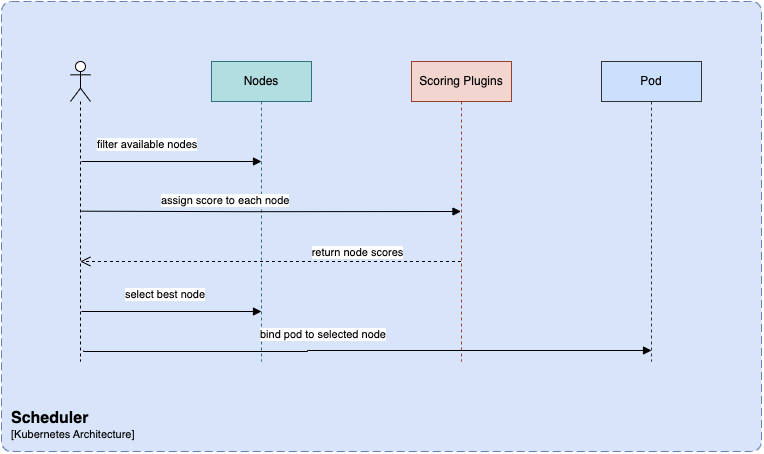
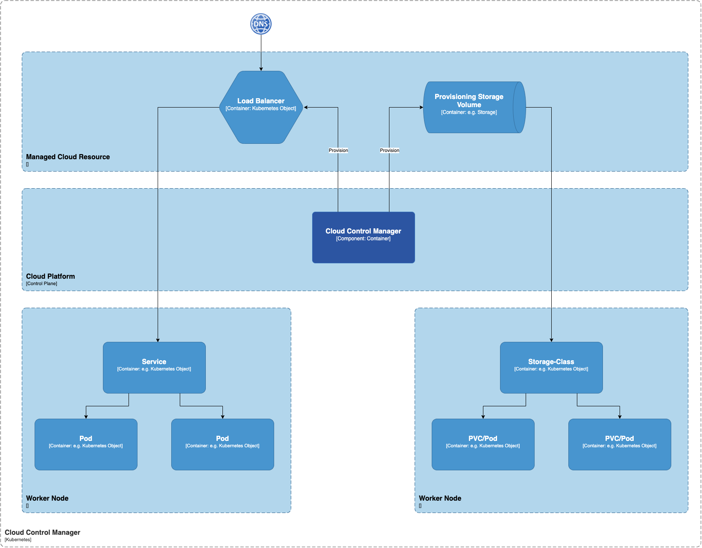

# Kubernetes

Kubernetes is a container orchestration system that helps automate application deployment, scaling, and management. It groups containers into logical units, making managing them easier. Kubernetes provides features of auto-scaling, load balancing, self-healing, and service discovery. Originally built by Google, it is currently maintained by the Cloud Native Computing Foundation.

## Architecture

Kubernetes architecture is a set of components spread across different servers or clusters that work together to ensure a reliable and adaptable environment for containerized workloads.

Each Kubernetes cluster consists of control plane nodes and worker nodes. Let’s understand these and other critical elements of the Kubernetes architecture diagram in detail.

## Components

The Kubernetes architecture follows a master-worker model, where the master, known as the control plane, manages the worker nodes. On the other hand, containers (encapsulated in pods) are deployed and executed in the worker nodes. These nodes can have virtual machines (on-premise or on the cloud) or physical servers.

### Control Plane

The control plane is responsible for container orchestration and maintains the state of a cluster.

**Control Plane Components**

The Kubernetes control plane consists of several components, each responsible for a specific task (as explained below). These components work together to ensure that each Kubernetes cluster’s state matches the pre-defined desired state.

### API Server

The kube-API server helps users and other components communicate with the cluster easily. Some monitoring systems and third-party services may also (very rarely) use it to interact with the cluster. When using a CLI like kubectl to manage the cluster, you use HTTP REST APIs to talk to the API server.

> The internal cluster components (like the scheduler and controller), however, use gRPC for this communication.

The API server encrypts its communication with other components to ensure safety through TLS. Its primary function is to manage API requests, validate data for API objects, authenticate and authorize users, and coordinate processes between the control plane and worker node components.

The API server works only with etcd and includes a built-in bastion apiserver proxy, enabling external access to ClusterIP services.

### etcd

etcd is a useful tool for storing key-value data in a distributed approach. It’s designed for storing data about Kubernetes clusters, such as information about pods, their state, and namespaces. etcd is only accessible from the API server to maintain security.

Kubernetes uses etcd to manage its key-value API through gRPC. All objects are stored under the /registry directory key in key-value format.

The api-server of Kubernetes uses the etcd’s watch feature to monitor any modifications to an object’s state. As the sole Statefulset component in the control plane, etcd is an excellent database for Kubernetes.

### kube-scheduler

When deploying a pod in a Kubernetes cluster, the kube-scheduler identifies the best worker node that satisfies the pod requirements, such as CPU, memory, and affinity. Upon identification, it schedules the pod on the right node.

This process is made possible because of etcd’s role in storing vital information needed by Kubernetes to run smoothly. The necessary information is stored in the etcd file cabinet whenever a request is made to Kubernetes.

Kubernetes schedules a pod using several techniques.

First, it filters through all available nodes to find the best ones for the pod. Then, it assigns each node a score based on scheduling plugins. The scheduler selects the best node and binds the pod to it. This process ensures that high-priority pods get the priority they deserve and that custom plugins can be easily added to the mix. It’s an innovative and efficient way to manage Kubernetes pods.

### Controller-Manager

The kube-controller-manager handles different controllers that help create replicas of containers and ensure the cluster stays in the desired state.

**Example**

when you create a manifest YAML file to specify the deployment ( two replicas, one volume mount, config map, etc.). With the in-built deployment controller, the deployment will always remain in the desired state.

There are several types of controllers managed by the kube-controller-manager:

* **Deployment controllers** handle the deployment of multiple replicas of an application running inside containers.

* **Replication controllers** ensure a specific number of pod replicas are always running. If a pod fails, the replication controller creates a new one to take its place.

* **StatefulSet controllers** provide useful features like persistent storage, unique network identities, and a controlled way to deploy and scale the application.

* **DaemonSet controllers** ensure that a specific pod runs on every node in the cluster or only on selected nodes based on particular labels.

### Cloud Controller Manager (CCM)

When deploying Kubernetes in cloud environments, it’s essential to bridge Cloud Platform APIs and the Kubernetes cluster. This can be done using the cloud controller manager, which allows the core Kubernetes components to work independently and enables cloud providers to integrate with Kubernetes using plugins.

Cloud Controller Manager contains a set of cloud platform-specific controllers that ensure the desired state of cloud-specific components (nodes, Loadbalancers, storage, etc). Following are the three main controllers that are part of the cloud controller manager.

* **Node controller:** This controller updates node-related information by talking to the cloud provider API. For example, node labeling & annotation, getting hostname, CPU & memory availability, nodes health, etc.
* **Route controller:** It is responsible for configuring networking routes on a cloud platform. So that pods in different nodes can talk to each other.
* **Service controller:** It takes care of deploying load balancers for kubernetes services, assigning IP addresses, etc.

Following are some of the classic examples of cloud controller manager.

Deploying Kubernetes Service of type Load balancer. Here Kubernetes provisions a Cloud-specific Loadbalancer and integrates with Kubernetes Service.
Provisioning storage volumes (PV) for pods backed by cloud storage solutions.
Overall Cloud Controller Manager manages the lifecycle of cloud-specific resources used by kubernetes.

## Worker Node

Worker nodes are critical components in a Kubernetes architecture because they help in running containerized applications.

## Worker Node Components

Worker nodes are the primary execution units in a Kubernetes cluster where the actual workloads run. Each worker node can host multiple pods, each containing one or more containers running inside them. Every worker node consists of three components responsible for scheduling and managing these pods:

### Kubelet

The kubelet is an essential component that runs on every node in the Kubernetes cluster. It acts as an agent responsible for registering worker nodes with the API server and working with the podSpec primarily from the API server.

The kubelet creates, modifies, and deletes containers for the pod. Additionally, it handles liveliness, readiness, and startup probes. It also mounts volumes by reading pod configuration and creating respective directories reporting Node pod status via calls to the API server.

The Kubelet starts the api-server, scheduler, and controller manager as static pods while bootstrapping the control plane. The kubelet is crucial in managing the containers and ensuring the pod is in the desired state.

## Kube Proxy

Kube-proxy is a daemon that runs on every node as a daemonset. It is a proxy component that implements the Kubernetes Services concept for pods. (single DNS for a set of pods with load balancing). It primarily proxies UDP, TCP, and SCTP and does not understand HTTP.

Kube-proxy communicates with the API server to get the details about the Services and their respective pod IPs and ports. It monitors for service changes and end points and then uses various modes to create or update rules for routing traffic to pods behind a Service.

The modes include IPTables, IPVS, Userspace, and Kernelspace. When using IPTables mode, Kube-proxy handles traffic with IPtable rules and randomly selects a backend pod for load balancing.