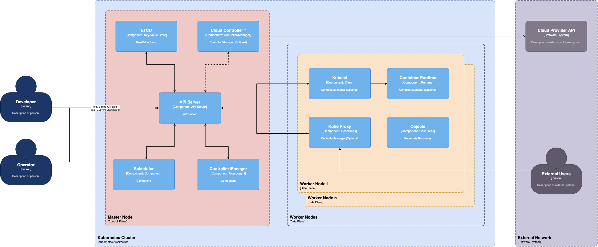

# Kubernetes

Kubernetes is a container orchestration system that helps automate application deployment, scaling, and management. It groups containers into logical units, making managing them easier. Kubernetes provides features of auto-scaling, load balancing, self-healing, and service discovery. Originally built by Google, it is currently maintained by the Cloud Native Computing Foundation.

## Architecture

Kubernetes architecture is a set of components spread across different servers or clusters that work together to ensure a reliable and adaptable environment for containerized workloads.

Each Kubernetes cluster consists of control plane nodes and worker nodes. Let’s understand these and other critical elements of the Kubernetes architecture diagram in detail.

