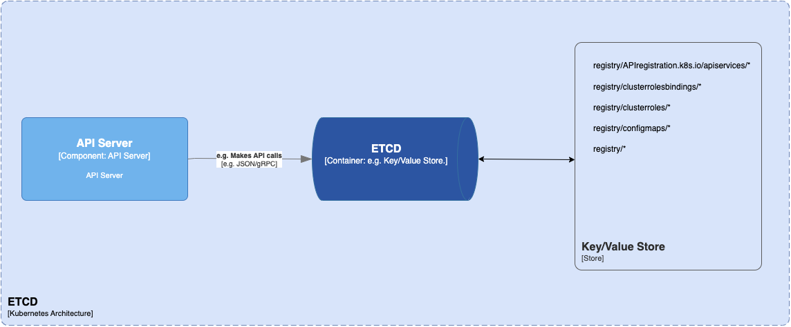

#### etcd

etcd is a useful tool for storing key-value data in a distributed approach. It’s designed for storing data about Kubernetes clusters, such as information about pods, their state, and namespaces. etcd is only accessible from the API server to maintain security.

Kubernetes uses etcd to manage its key-value API through gRPC. All objects are stored under the /registry directory key in key-value format.

The api-server of Kubernetes uses the etcd’s watch feature to monitor any modifications to an object’s state. As the sole Statefulset component in the control plane, etcd is an excellent database for Kubernetes.