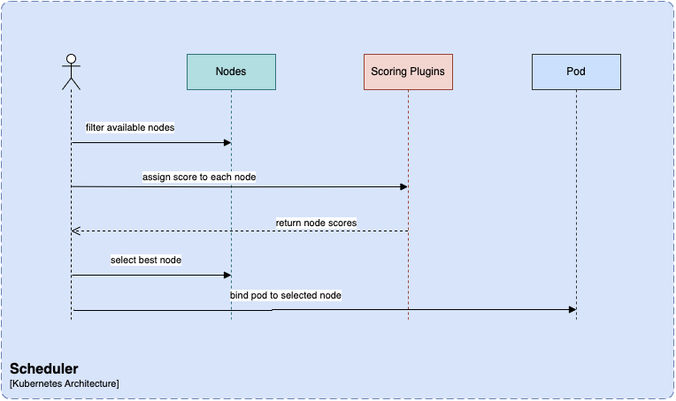

#### Kube-Scheduler

When deploying a pod in a Kubernetes cluster, the kube-scheduler identifies the best worker node that satisfies the pod requirements, such as CPU, memory, and affinity. Upon identification, it schedules the pod on the right node.

This process is made possible because of etcd’s role in storing vital information needed by Kubernetes to run smoothly. The necessary information is stored in the etcd file cabinet whenever a request is made to Kubernetes.

Kubernetes schedules a pod using several techniques.

First, it filters through all available nodes to find the best ones for the pod. Then, it assigns each node a score based on scheduling plugins. The scheduler selects the best node and binds the pod to it. This process ensures that high-priority pods get the priority they deserve and that custom plugins can be easily added to the mix. It’s an innovative and efficient way to manage Kubernetes pods.
