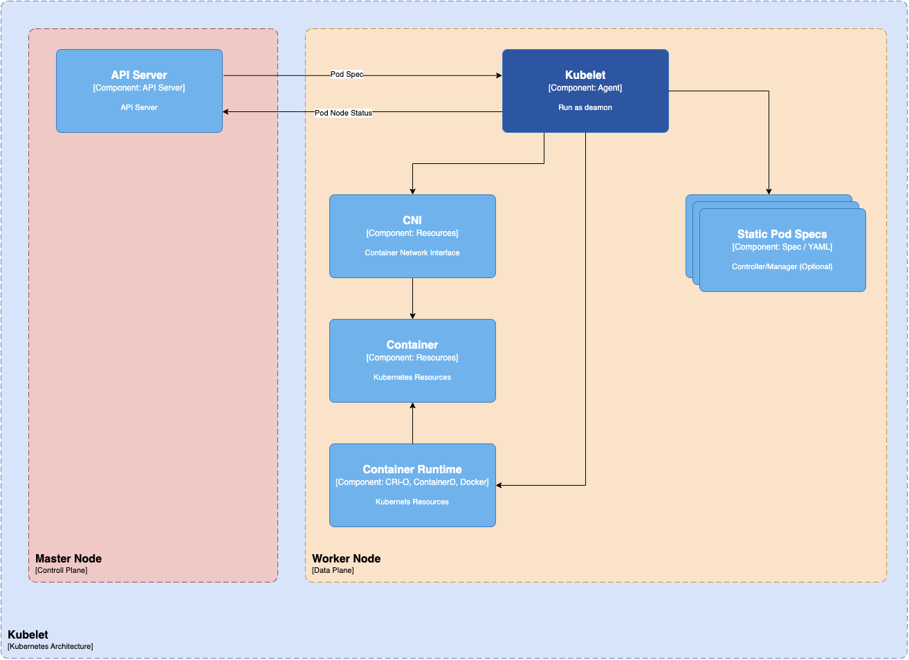

### Worker Nodes

Worker nodes are critical components in a Kubernetes architecture because they help in running containerized applications.

### Worker Node Components

Worker nodes are the primary execution units in a Kubernetes cluster where the actual workloads run. Each worker node can host multiple pods, each containing one or more containers running inside them. Every worker node consists of three components responsible for scheduling and managing these pods:

#### Kubelet

The kubelet is an essential component that runs on every node in the Kubernetes cluster. It acts as an agent responsible for registering worker nodes with the API server and working with the podSpec primarily from the API server.

The kubelet creates, modifies, and deletes containers for the pod. Additionally, it handles liveliness, readiness, and startup probes. It also mounts volumes by reading pod configuration and creating respective directories reporting Node pod status via calls to the API server.

The Kubelet starts the api-server, scheduler, and controller manager as static pods while bootstrapping the control plane. The kubelet is crucial in managing the containers and ensuring the pod is in the desired state.

#### Kube Proxy

Kube-proxy is a daemon that runs on every node as a daemonset. It is a proxy component that implements the Kubernetes Services concept for pods. (single DNS for a set of pods with load balancing). It primarily proxies UDP, TCP, and SCTP and does not understand HTTP.

Kube-proxy communicates with the API server to get the details about the Services and their respective pod IPs and ports. It monitors for service changes and end points and then uses various modes to create or update rules for routing traffic to pods behind a Service.

The modes include IPTables, IPVS, Userspace, and Kernelspace. When using IPTables mode, Kube-proxy handles traffic with IPtable rules and randomly selects a backend pod for load balancing.

#### Container Runtime

Just like Java Runtime (JRE) is required to run Java programs, container runtime is essential to running containers. Container runtime is responsible for various tasks, such as pulling images from container registries, allocating and isolating resources for containers, and managing the entire lifecycle of a container on a host.

Kubernetes interacts with container runtimes through Container Runtime Interface (CRI), which defines the API for creating, starting, stopping, and deleting containers and managing images and container networks.

The Open Container Initiative (OCI) is a set of standards for container formats and runtimes. Kubernetes supports multiple container runtimes compliant with CRI, such as CRI-O, Docker Engine, and containerd.

The kubelet agent interacts with the container runtime using CRI APIs to manage the lifecycle of a container and provides all the container information to the control plane.
